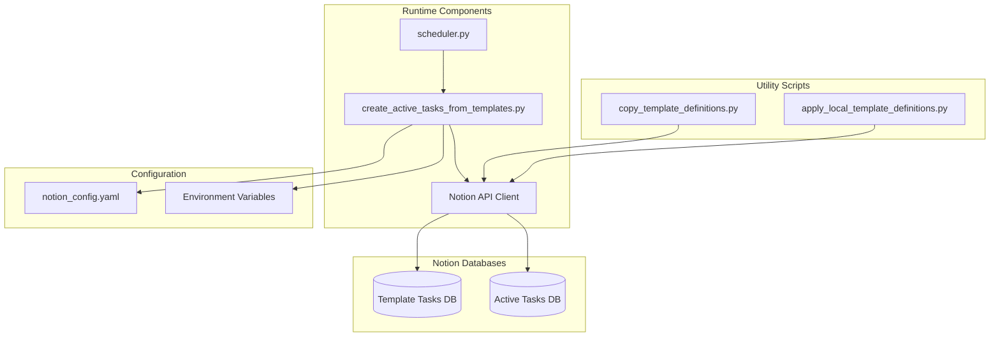
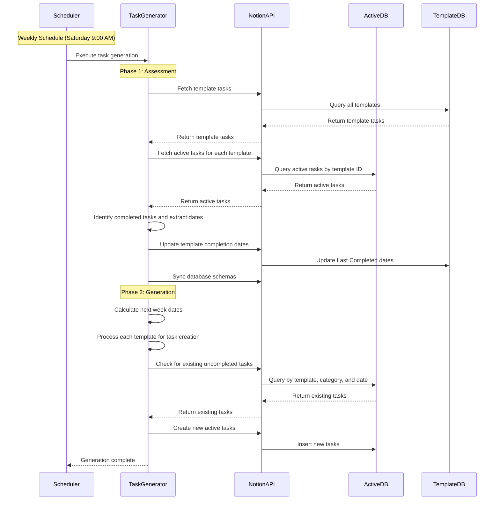

# Home TaskManager - System Design

This document describes the architecture, execution flow, and component relationships of the Home TaskManager system.

## System Overview

The Home TaskManager is a Python-based automation system that manages recurring household tasks through Notion databases. It operates on a two-database model:

- **Template Tasks Database**: Stores task definitions with frequency, category, and completion tracking
- **Active Tasks Database**: Contains actionable tasks generated from templates with planned dates and status tracking

## Execution Flow

The system follows a specific execution order to ensure accurate task generation:

### 1. Assessment Phase
Active tasks are first assessed to understand completion status and update template completion dates:

1. **Fetch Template Tasks**: Query all template tasks from the Template Tasks database
2. **Fetch Active Tasks**: For each template, query all associated active tasks
3. **Identify Completed Tasks**: Find active tasks with "Complete" status using dynamic status group detection
4. **Extract Completion Dates**: Get the most recent completion date from "Completed Date" property
5. **Update Template Completion Dates**: Update the template's "Last Completed" date with the most recent completion
6. **Sync Database Schemas**: Ensure select and status options are synchronized between databases

### 2. Generation Phase
Active tasks are then created as needed from template tasks:

1. **Get Next Week Dates**: Calculate planned dates for the coming week (Monday, Tuesday, Friday)
2. **Process Each Template**: For each template task:
   - Determine frequency and category matching logic
   - Check if task is due for the week using `is_task_due_for_week()`
   - Check for existing uncompleted tasks using `uncompleted_task_exists_for_date()`
   - Create new active tasks with appropriate properties and planned dates
3. **Category-Specific Logic**:
   - **Monday/Friday**: Creates both Monday and Friday tasks regardless of template category
   - **Daily**: Creates tasks for all three workdays regardless of template category
   - **Other frequencies**: Only creates tasks when template category matches workday category

## Component Architecture

## Runtime Components

### 1. Scheduler (`scripts/scheduler.py`)
**Role**: Orchestrates the automated execution of task generation
- Runs continuously in a container
- Schedules weekly task generation for Saturdays at 9:00 AM UTC
- Handles first-run execution (runs immediately on container startup)
- Manages logging and error handling for the scheduling process

**Key Functions**:
- `run_weekly_tasks()`: Executes the main task generation script
- `schedule_weekly_run()`: Sets up the weekly schedule
- `run_immediately_if_needed()`: Handles first-run and immediate execution logic

### 2. Task Generator (`scripts/weekly_rollover/create_active_tasks_from_templates.py`)
**Role**: Core business logic for task assessment and generation
- Implements the two-phase execution flow (Assessment → Generation)
- Handles all Notion API interactions
- Manages frequency calculations and date logic
- Prevents duplicate task creation

**Key Functions**:
- `main()`: Orchestrates the entire two-phase process
- `get_active_tasks_for_template()`: Retrieves all active tasks for a template
- `is_status_complete()`: Determines if a task is in the "Complete" status group
- `extract_completed_date()`: Extracts completion date from active tasks
- `update_template_last_completed()`: Updates template completion dates
- `sync_options()`: Ensures database schema consistency
- `is_task_due_for_week()`: Determines if a task is due for a specific week
- `uncompleted_task_exists_for_date()`: Checks for existing uncompleted tasks
- `build_active_task_properties()`: Builds properties for new active tasks

### 3. Notion API Client
**Role**: Provides interface to Notion databases
- Handles authentication and API calls
- Manages rate limiting and error handling
- Provides data transformation between Notion format and internal format

## Utility Scripts (Template Management)

The `scripts/template_management/` directory contains utility scripts that are **not part of the runtime system**. These are development and maintenance tools:

### 1. `copy_template_definitions.py`
**Purpose**: Backup utility for template tasks
- Exports template tasks and schema to local YAML file
- Useful for version control and backup purposes
- Can be run manually when needed

### 2. `apply_local_template_definitions.py`
**Purpose**: Template deployment utility
- Applies local template definitions to Notion database
- Useful for setting up new environments or updating templates
- Can be run manually when needed

**Important**: These utility scripts are separate from the continuous runtime system and are only used for setup, maintenance, and backup operations.

## Data Flow

## Frequency Logic

The system implements sophisticated frequency logic for task generation:

### Standard Frequencies
- **Daily**: Creates tasks for all three workdays (Monday, Tuesday, Friday) if not completed on the planned date
- **Weekly**: Creates one task per week if not completed in the week before the planned date
- **Monthly**: Creates one task per month if not completed in the previous month
- **Quarterly**: Creates one task per quarter if not completed in the previous quarter
- **Yearly**: Creates one task per year if not completed in the previous year

### Special Handling: Monday/Friday
Tasks with "Monday/Friday" frequency are automatically split into two active tasks:
- One with "Random/Monday" category for Monday
- One with "Cleaning/Friday" category for Friday

This allows the same task template to be scheduled for both themed workdays. The system creates both tasks regardless of the template's original category.

### Category Matching Logic
- **Monday/Friday frequency**: Always creates both Monday and Friday tasks with appropriate categories
- **Daily frequency**: Creates tasks for all three workdays (Monday, Tuesday, Friday) regardless of template category
- **Other frequencies**: Only creates tasks when the template's category matches the workday category

## Error Handling and Resilience

The system includes comprehensive error handling:

1. **API Rate Limiting**: Basic error handling for API calls (no explicit retry logic implemented)
2. **Network Failures**: Basic exception handling without exponential backoff
3. **Schema Mismatches**: Automatically syncs database schemas to prevent errors
4. **Invalid Data**: Validates data before processing and logs warnings
5. **Scheduler Resilience**: Continues running even if individual task generation fails
6. **Status Group Detection**: Dynamically detects "Complete" status group from schema
7. **Date Parsing**: Handles timezone-aware and timezone-naive dates

## Configuration Management

The system uses a YAML-based configuration approach:

- `notion_config.yaml`: Database IDs and API configuration
- Environment variables: API tokens and sensitive data
- Docker volumes: Persistent configuration and state management

## Deployment Architecture

The system is designed for containerized deployment:

- **Docker Container**: Runs continuously with restart policy
- **Volume Mounts**: Configuration, logs, and state persistence
- **Environment Variables**: Secure credential management
- **Health Monitoring**: Comprehensive logging for operational visibility

## Performance Considerations

1. **Pagination**: Uses cursor-based pagination for large datasets
2. **Schema Caching**: Retrieves schemas once and reuses them
3. **Efficient Filtering**: Uses Notion database filters to reduce data transfer
4. **Minimal Dependencies**: Lightweight runtime with focused functionality
5. **Selective Updates**: Only updates template completion dates when necessary
