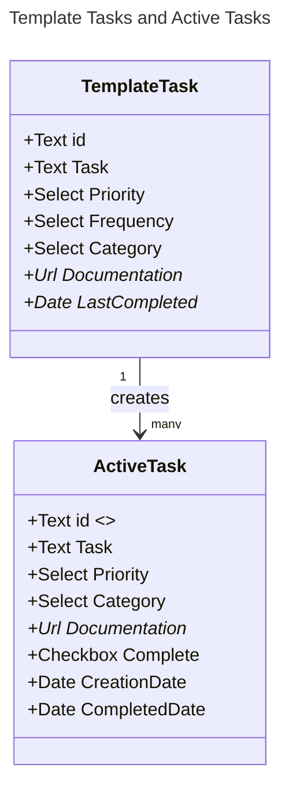

# Notion Task DB

```mermaid
---
title: Template Tasks and Active Tasks
---
classDiagram
    class TemplateTask {
        +Text id
        +Text Task 
        +Select Priority
        +Select Frequency
        +Select Category
        +Url Documentation*
        +Date LastCompleted*
    }

    class ActiveTask {
        +Text id <<ref: TemplateTask.id>>
        +Text Task 
        +Select Priority
        +Select Category
        +Url Documentation*
        +Checkbox Complete
        +Date CreationDate
        +Date CompletedDate
    }

    TemplateTask "1" --> "many" ActiveTask : creates

```