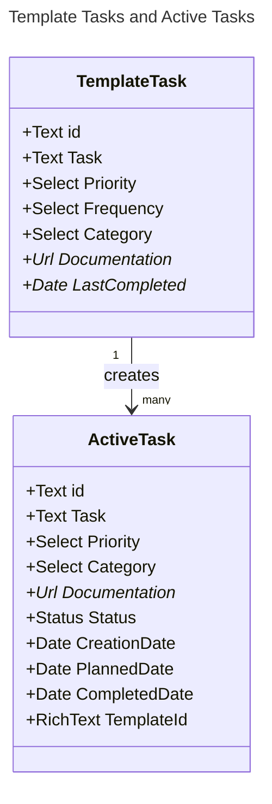

# Notion Task DB



## Status Property Schema

The `Status` property on ActiveTask is a Notion status field with **groups** and **options**.

### Status Groups

Notion organizes status options into groups. The code relies on these group names:

| Group Name | Purpose | Code Usage |
|------------|---------|------------|
| `To-do` | Tasks not yet started | Default status for new tasks |
| `In progress` | Tasks being worked on | - |
| `Complete` | Tasks that are finished | Used by `is_status_complete()` to filter |

### Status Options

The following status option names are expected:

| Option Name | Group | Code Dependency |
|-------------|-------|-----------------|
| `Not Started` | To-do | Preferred default for new tasks |
| `In Progress` | In progress | - |
| **`Done`** | Complete | ⚠️ **HARDCODED** in `is_status_done()` - must match exactly |
| `Not Needed` | Complete | Treated as complete but NOT as "done" |
| `Duplicate?` | Complete | Treated as complete but NOT as "done" |

### ⚠️ Important: "Done" Status Contract

The code in `create_active_tasks_from_templates.py` has a hardcoded dependency on the status name `"Done"`:

```python
# is_status_done() at line 203
return status_val.get("name") == "Done"
```

**This means:**
- Only tasks with status name exactly `"Done"` will update the template's `Last Completed` date
- If you rename this status in Notion, the `Last Completed` tracking will silently break
- Tasks marked `Not Needed` or `Duplicate?` will NOT update `Last Completed` (intentional behavior from PR #6)

### Distinction: Complete vs Done

- **`is_status_complete()`**: Schema-driven. Checks if status ID is in the "Complete" **group**. Used for filtering uncompleted tasks.
- **`is_status_done()`**: Hardcoded. Checks if status **name** equals `"Done"`. Used for tracking actual task completion.

## Property Mappings

Properties copied from TemplateTask to ActiveTask:

| Template Property | Active Property | Type |
|-------------------|-----------------|------|
| Task | Task | Title |
| Priority | Priority | Select |
| Category | Category | Select |
| Documentation | Documentation | URL |
| (id) | TemplateId | Rich Text |

## Frequency Values

The `Frequency` select property on TemplateTask supports:

| Value | Behavior |
|-------|----------|
| `Daily` | Creates task for all three workdays |
| `Weekly` | Creates if not completed in prior week |
| `Monthly` | Creates if 1+ month since last completion |
| `Quarterly` | Creates if 3+ months since last completion |
| `Yearly` | Creates if 1+ year since last completion |
| `Monday/Friday` | Creates for both Random/Monday and Cleaning/Friday |

## Category Values

Categories map to specific days:

| Category | Day |
|----------|-----|
| `Random/Monday` | Monday |
| `Cooking/Tuesday` | Tuesday |
| `Cleaning/Friday` | Friday |